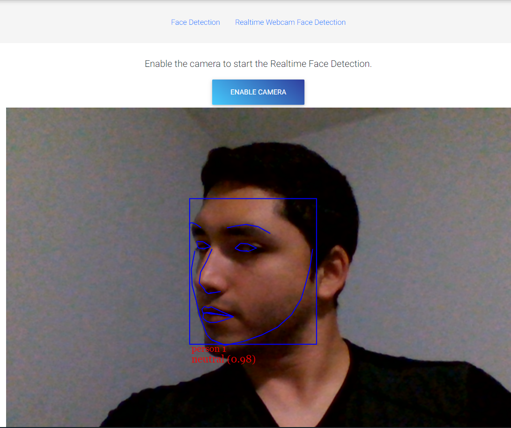

# Realtime Face Detection Using Tensorflow.js and Face_Api.js

# Description
Check out the implementation of a real-time pose-detector client-side (In the Browser) using Tensorflow.js.

**Demo:**

https://rubencg195.github.io/pages/face_detection/

**Images:**

